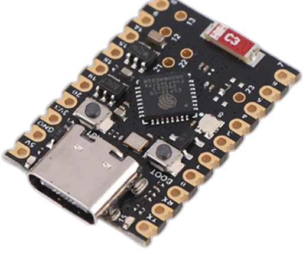
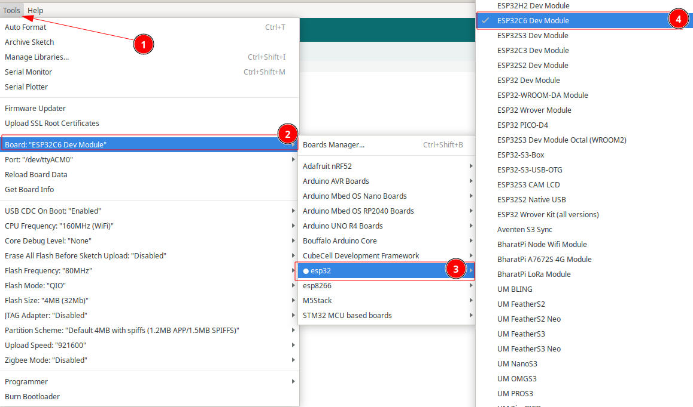
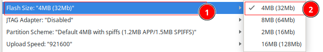
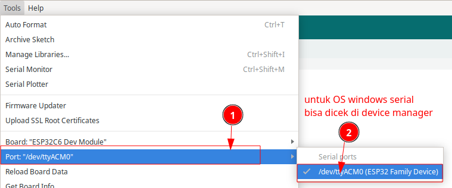
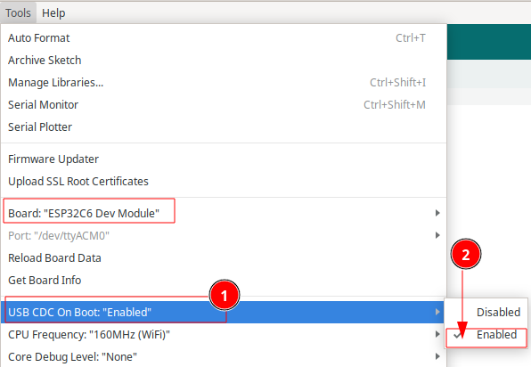
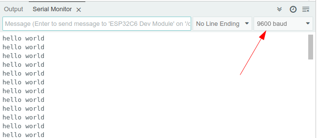

# Tutorial  Nologo Super Mini ESP32-C6



| Perangkat | Pin/Alamat | Keterangan |
| --------- | ---------- | ---------- |
| LED       | GPIO15     | LED        |


[TOC]

## Install Board

1. Masuk ke preferences


2. Klik Additional Board Manager


3. Tambahkan board esp32 kalimat berikut https://raw.githubusercontent.com/espressif/arduino-esp32/gh-pages/package_esp32_index.json


4. Pilih Tools -> Board -> Board Manager


5. Search ESP32 kemudian klik install


6. Pilih Tools -> Board -> ESP32 -> esp32C6 dev Module



7. Langkah berikutnya adalah memastikan Arduino mengetahui Kapasitas Flash yang tersedia. ini dilakukan dengan cara mengatur konfigurasi "Flash Size".  Sesuaikan Flash anda (4MB) menggunakan konfigurasi seperti pada gambar berikut




8. Setting port serial , untuk windows bisa cek device manager, pastikan anda telah install driver serial usb anda, bila tidak dikenali di windows install driver serial tersebut melalui link https://www.wch-ic.com/search?q=CH343&t=downloads




## Contoh Kode Program

 buat file baru atau buka contoh program di **File -> Examples -> Basics -> BareMinimum**.  kemudain yang harus anda lakukan adalah:

1. Gantikan kode yang ada dengan kode berikut:

```c++
#define LED_BUILTIN 15
// the setup function runs once when you press reset or power the board
void setup() {
  // initialize digital pin LED_BUILTIN as an output.
  pinMode(LED_BUILTIN, OUTPUT);
}

// the loop function runs over and over again forever
void loop() {
  digitalWrite(LED_BUILTIN, HIGH);  // turn the LED on (HIGH is the voltage level)
  delay(100);                      // wait for a second
  digitalWrite(LED_BUILTIN, LOW);   // turn the LED off by making the voltage LOW
  delay(1000);                      // wait for a second
}

```


## Upload program

Agar serial port dikenal dan bisa melakukan upload  program maka terlebih dahulu masuk ke mode bootloader. Step by step masuk mode bootloader dan melaukan program sebagai berikut:

- Tekan dan tahan tombol Boot/0  
- Klik(tekan dan lepas) tombol reset/EN sambil tetap tekan tombol Boot .
- Lepas tombol boot

Saat ini anda sudah masuk mode bootloader, bersamaan itu port serial di komputer akan muncul.   silahkan anda pilh port serial di arduino anda dan melakukakan langkah upload sebagai berikut:

- Klik tombol upload pada Arduino IDE, bila sukses akan menampilkan info

```cpp
- ---Compressed 261792 bytes to 122378...
- ---Writing at 0x00010000... (12 %)
- ---Writing at 0x00014000... (25 %)
- ---Writing at 0x00018000... (37 %)
```

- Setelah selesai Wajib klik tombol **reset** sekali lagi untuk berpindah dari mode download menjadi mode run

> [!NOTE]  
> INGAT YA WAJIB Di Klik Tombol RESET setelah proses upload selesai, tanpa itu program yang baru diupload tidak akan dijalankan


## Akses Serial Port di ESP32

Board **ESP32-C6 ** ini mendukung upload menggunakan Mode Native USB. Pada mode ini Komunikasi Serial ditangani oleh native USB yang merupakan fitur yang ada di ESP32-C6.  Berikutnya pastikan konfigurasi  USB CDC on Boot  enablekan.  Pengaturan ini memastikan board dapat menggunakan port USB internal untuk komunikasi serial. pilih Tools -> USB CDC on Boot -> Enabled




- Jalankan kode sederhana ini

```c++
void setup() {
  // initialize both serial ports:
  Serial.begin(9600);
  while(!Serial);
}

void loop() {
  Serial.println("hello world");
  delay(500);
}
```

- Klik **Verify** untuk memeriksa kode. 

- Tekan dan tahan tombol Boot/0  
- Klik(tekan dan lepas) tombol reset/EN sambil tetap tekan tombol Boot .
- Lepas tombol boot

Saat ini anda sudah masuk mode bootloader, bersamaan itu port serial di komputer akan muncul.   silahkan anda pilh port serial di arduino anda dan melakukakan langkah upload sebagai berikut:

- Klik tombol upload pada Arduino IDE, bila sukses akan menampilkan info

```cpp
- ---Compressed 261792 bytes to 122378...
- ---Writing at 0x00010000... (12 %)
- ---Writing at 0x00014000... (25 %)
- ---Writing at 0x00018000... (37 %)
```

- Setelah selesai Wajib klik tombol **reset** sekali lagi untuk berpindah dari mode download menjadi mode run

> [!NOTE]  
> INGAT YA WAJIB Di Klik Tombol RESET setelah proses upload selesai, tanpa itu program yang baru diupload tidak akan dijalankan

- Bila sudah selesai Silahkan buka Tools -> Serial Monitor
- Atur baud rate di pojok kanan bawah menjadi **9600** (sesuai dengan `Serial.begin(9600)` di kode).
- Anda akan melihat teks **"hello world"** muncul setiap 500ms.



## Pemecahan Masalah

### A. Port Com  tidak dapat dikenali di Arduino

Bila port COM di windows tidak dikenali pastikan install driver terlebih dahulu ada  beberapa kemungkinan yaitu permasalaha di chip, permasalah di usb serial, permasalahan di kabe dan permasalahan di komputer. 

#### 1. Belum masuk Mode Bootloader

Belum masuk mode bootloader juga menyebebkan komputer tidak mengenali device ESP32. Untuk mengatasi ini caranya cukup simple yaitu dengan menekan tombol tertentu yang ada di ESP32 sehingga bisa masuk mode bootloader. untuk masuk ke mode bootloader  caranya sebagai berikut:

- Tekan dan tahan tombol Boot/0  
- Klik(tekan dan lepas) tombol reset/EN sambil tetap tekan tombol Boot .
- Lepas tombol boot

#### 2. Permasalahan kabel USB
Bila masih belum dikenali kemungkinan Kabel USB bukan merupakan kabel data melainkan kabel power saja. Jadi pastikan menggunakan kabel data yang berkualitas yang pendek (maksimal 1m). bila tidak dikenali juga coba di pindah port usb lainnya di komputer tersebut atau menggunakan komputer lainnya.  

### B. Program tidak dapat berjalan setelah diunggah

Setelah upload berhasil, Anda perlu menekan tombol Reset sebelum dapat dijalankan.

